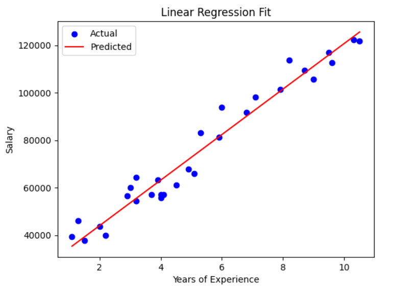
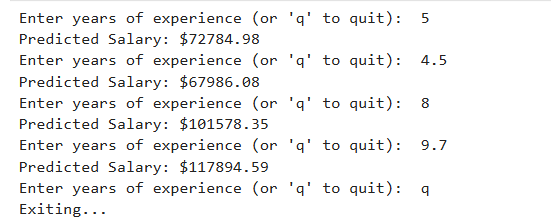

# Salary Predictor Using Linear Regression from Scratch

A simple Python project that predicts salaries based on years of experience using **linear regression implemented from scratch** — no scikit-learn or other ML libraries used.

## Dataset
This project uses the **Salary Data Dataset** from Kaggle:  
[Salary Data Dataset for Linear Regression](https://www.kaggle.com/datasets/shubham47/salary-data-dataset-for-linear-regression)

It contains:
- `YearsExperience` – number of years of experience
- `Salary` – corresponding salary

## Features
- Manual implementation of **gradient descent** for linear regression 
- Predicts salary for any input years of experience
- Visualizes the data points and the regression line
- Interactive input for real-time salary prediction

## Example Output

### Regression Plot


### Interactive Prediction


## How to Use
1. Download or clone this repository to your local machine.
2. Place the dataset `Salary_Data.csv` in the project folder.
3. Install required libraries:
   ```bash
   pip install numpy pandas matplotlib

